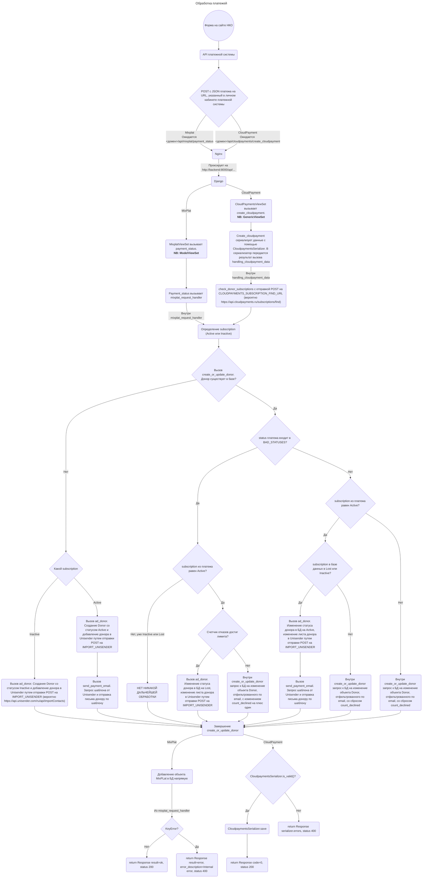
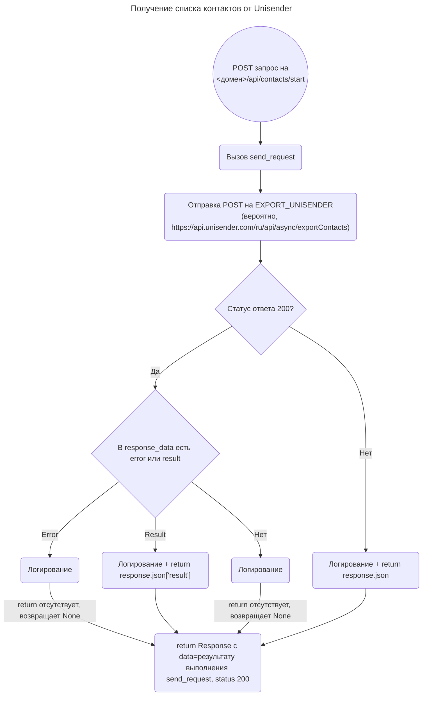
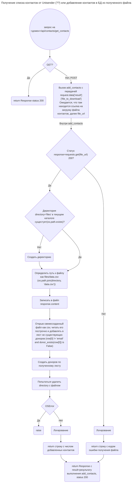
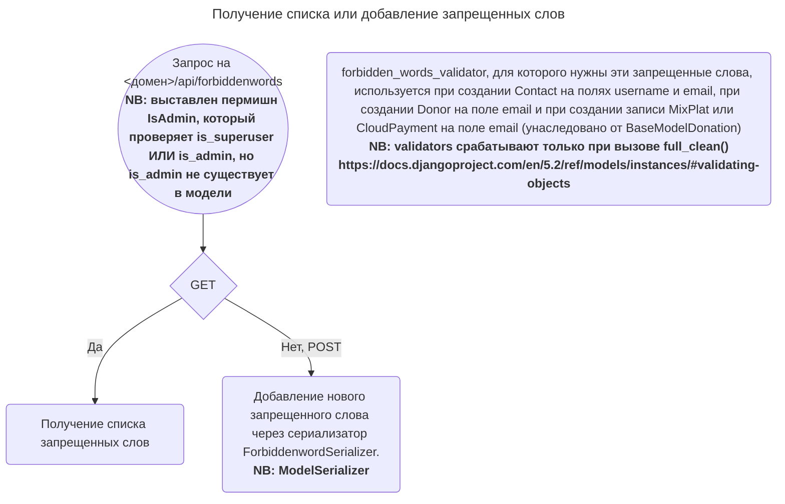
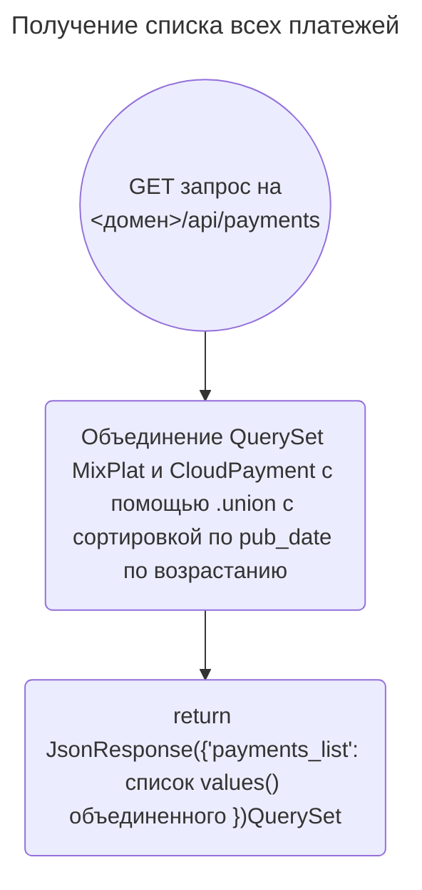

```mermaid
---
title: Обработка платежей
---
flowchart TD
A(Форма на сайте НКО)@{shape: circle} --> B
B(API платежной системы) --> C

C{POST c JSON платежа на URL, указанный в личном кабинете платежной системы}
    C --> |Mixplat<br>Ожидается <домен>/api/mixplat/payment_status| D
    C --> |CloudPayment<br>Ожидается <домен>/api/cloudpayments/create_cloudpayment| D 

D(Nginx) --> |Проксирует на http://backend:8000/api/...| E 

E(Django)
E --> |MixPlat| E1("`MixplatViewSet вызывает payment_status.<br>**NB: ModelViewSet**`")
    E1 --> E1a(Payment_status вызывает mixplat_request_handler)
    E1a --> |Внутри mixplat_request_handler| F

E --> |CloudPayment| E2("`CloudPaymentsViewSet вызывает create_cloudpayment.<br>**NB: GenericViewSet**`")
    E2 --> E2a(Сreate_cloudpayment сериализует данные с помощью CloudpaymentsSerializer. В сериализатор передается результат вызова handling_cloudpayment_data)
    E2a --> |Внутри handling_cloudpayment_data| E2b("`check_donor_subscriptions с отправкой POST на CLOUDPAYMENTS_SUBSCRIPTION_FIND_URL (вероятно https://api.cloudpayments.ru/subscriptions/find)`")
    E2b --> F

F("`Определение subscription (Active или Inactive)`")
F --> G{Вызов create_or_update_donor. Донор существует в базе?}

G --> |Нет| G1
    G1{Какой subscription}
    G1 -->|Inactive| G1a("`Вызов ad_donor. Создание Donor со статусом Inactive и добавление донора в Unisender путем отправки POST на IMPORT_UNISENDER (вероятно https://api.unisender.com/ru/api/importContacts)`")
        G1a --> H("Завершение create_or_update_donor")
    G1 -->|Active| G1b(Вызов ad_donor. Создание Donor со статусом Active и добавление донора в Unisender путем отправки POST на IMPORT_UNISENDER)
        G1b --> G1c(Вызов send_payment_email. Запрос шаблона от Unisender и отправка письма донору по шаблону)
            G1c --> H

G -->|Да| G2
    G2{"status платежа входит в BAD_STATUSES?"}
    G2 -->|Да| G2a
        G2a{"subscription из платежа равен Active?"}
        G2a -->|Нет, уже Inactive или Lost| G2c(НЕТ НИКАКОЙ ДАЛЬНЕЙШЕЙ ОБРАБОТКИ)
            G2c --> H
        G2a -->|Да| G2d
            G2d{"Счетчик отказов достиг лимита?"}
            G2d -->|Да| G2e(Вызов ad_donor. Изменение статуса донора в БД на Lost, изменение листа донора в Unisender путем отправки POST на IMPORT_UNISENDER)
                G2e --> H
            G2d -->|Нет| G2f(Внутри create_or_update_donor запрос к БД на изменение объекта Donor, отфильтрованного по email, c изменением count_declined на плюс один)
                G2f --> H
    G2 -->|Нет| G2b
        G2b{"subscription из платежа равен Active?"}
        G2b -->|Да| G2g
            G2g{"subscription в базе данных в Lost или Inactive?"}
            G2g -->|Да| G2h(Вызов ad_donor. Изменение статуса донора в БД на Active, изменение листа донора в Unisender путем отправки POST на IMPORT_UNISENDER)
                G2h --> G2i(Вызов send_payment_email. Запрос шаблона от Unisender и отправка письма донору по шаблону)
                    G2i --> H
            G2g -->|Нет| G2j(Внутри create_or_update_donor запрос к БД на изменение объекта Donor, отфильтрованного по email, cо сбросом count_declined)
                G2j --> H
        G2b -->|Нет| G2k(Внутри create_or_update_donor запрос к БД на изменение объекта Donor, отфильтрованного по email, cо сбросом count_declined)
            G2k --> H

H("Завершение create_or_update_donor")
H --> |MixPlat| H1(Добавление объекта MixPLat в БД напрямую)
    H1 --> |Из mixplat_request_handler|I{KeyError?}
        I --> |Нет| I1(return Response result=ok, status 200)
        I --> |Да| I2(return Response result=error, error_description=Internal error, status 400)

H --> |CloudPayment| H2{"CloudpaymentsSerializer.is_valid()?"}
    H2 --> |Да| H2a(CloudpaymentsSerializer.save)
        H2a --> J(return Response code=0, status 200)
    H2 --> |Нет| H2b(return Response serializer.errors, status 400)
```

```mermaid
---
title: Получение списка контактов от Unisender
---
flowchart TD
A(POST запрос на <br><домен>/api/contacts/start)@{shape: circle} --> B(Вызов send_request)
B --> C("Отправка POST на EXPORT_UNISENDER<br>(вероятно, https://api.unisender.com/ru/api/async/exportContacts)")
C --> D

D{Статус ответа 200?}
D -->|Да| D1{В response_data есть error или result}
    D1 -->|Error| D1a(Логирование)
        D1a --> |return отсутствует, возвращает None| E
    D1 -->|Result| D1b("Логирование + return response.json['result']")
        D1b --> E
    D1 -->|Нет| D1c(Логирование)
        D1c --> |return отсутствует, возвращает None| E

D -->|Нет| D2(Логирование + return response.json)
    D2 --> E

E(return Response с data=результату выполнения send_request, status 200)

```

```mermaid
---
title: Получение списка контактов от Unisender (??) или добавление контактов в БД из полученного файла
---
flowchart TD
A(запрос на <br><домен>/api/contacts/get_contacts)@{shape: circle}-->B{GET?}
B --> |Да| B1(return Response status 200)
B --> |Нет, POST| B2("`Вызов add_contacts c передачей request.data['result']['file_to_download']<br>Ожидается, что там находится ссылка на загрузку файла контактов, далее file_url`")
    B2 -->|Внутри add_contacts|B3
    B3{"Статус response=requests.get(file_url) 200?"}
    B3 -->|Да| B3a{"Директория directory='files' в текущем каталоге сущестует(os.path.exists)?"}
        B3a -->|Нет| B3c(Создать директорию)
            B3c--> B3d
        B3a -->|Да| B3d("Определить путь к файлу как files/data.csv (os.path.join(directory, 'data.csv'))")
            B3d --> B3e(Записать в файл response.content)
            B3e --> B3f("Открыв свежесозданный файл как csv, читать его построчно и добавлять в лист не существующих доноров (row[0] != 'email' and donor_exists(row[0]) is False)")
            B3f --> B3g(Создать доноров по полученному листу)
            B3g --> B3h(Попытаться удалить directory с файлом)
            B3h --> B3i{OSError}
                B3i -->|Да| B3i1(raise)
                B3i -->|Нет| B3i2(Логирование)
                    B3i2 --> B3j(return строку с числом добавленных контактов)
                    B3j --> C
    B3 -->|Нет| B3b(Логирование)
        B3b --> B4(return строку с кодом ошибки получения файла)
            B4 --> C
C(return Response с result=результату выполнения add_contacts, status 200)
```

```mermaid
---
title: Получение списка или добавление запрещенных слов
---
flowchart TD
А("`Запрос на <br><домен>/api/forbiddenwords<br>**NB: выставлен пермишн IsAdmin, который проверяет is_superuser ИЛИ is_admin, но is_admin не существует в модели**`")@{shape: circle}-->B{GET}
B -->|Да| B1(Получение списка запрещенных слов)
B -->|Нет, POST| B2("`Добавление нового запрещенного слова через сериализатор ForbiddenwordSerializer.<br>**NB: ModelSerializer**`")
C("`forbidden_words_validator, для которого нужны эти запрещенные слова, используется при создании Contact на полях username и email, при создании Donor на поле email и при создании записи MixPlat или CloudPayment на поле email (унаследовано от BaseModelDonation)<br>**NB: validators срабатывают только при вызове full_clean()<br>https://docs.djangoproject.com/en/5.2/ref/models/instances/#validating-objects**`")
```

```mermaid
---
title: Получение списка всех платежей
---
flowchart TD
A(GET запрос на <br><домен>/api/payments)@{shape: circle}--> B(Объединение QuerySet MixPlat и CloudPayment с помощью .union с сортировкой по pub_date по возрастанию)
B --> C("return JsonResponse({'payments_list': список values() объединенного })QuerySet")
```