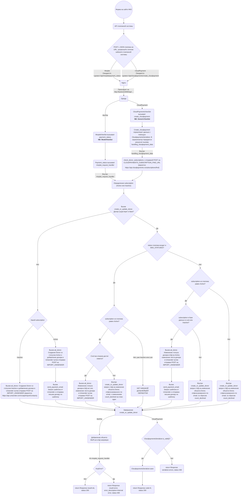

```mermaid
flowchart TD
A(Форма на сайте НКО)@{shape: circle} --> B
B(API платежной системы) --> C

C{POST c JSON платежа на URL, указанный в личном кабинете платежной системы}
C --> |Mixplat<br>Ожидается <домен>/api/mixplat/payment_status| D
C --> |CloudPayment<br>Ожидается <домен>/api/cloudpayments/create_cloudpayment| D 

D(Nginx) --> |Проксирует на http://backend:8000/api/...| E 

E(Django)
E --> |MixPlat| G("`MixplatViewSet вызывает payment_status.<br>**NB: ModelViewSet**`")
G --> I(Payment_status вызывает mixplat_request_handler)
I --> |Внутри mixplat_request_handler| J

E --> |CloudPayment| F("`CloudPaymentsViewSet вызывает create_cloudpayment.<br>**NB: GenericViewSet**`")
F --> H(Сreate_cloudpayment сериализует данные с помощью CloudpaymentsSerializer. В сериализатор передается результат вызова handling_cloudpayment_data)
H --> |Внутри handling_cloudpayment_data| P("`check_donor_subscriptions с отправкой POST на CLOUDPAYMENTS_SUBSCRIPTION_FIND_URL (вероятно https://api.cloudpayments.ru/subscriptions/find)`")
P --> J

J("`Определение subscription (Active или Inactive)`")
J --> K{Вызов create_or_update_donor. Донор существует в базе?}

K --> |Нет| K1
K1{Какой subscription}
K1 -->|Inactive| K1a("`Вызов ad_donor. Создание Donor со статусом Inactive и добавление донора в Unisender путем отправки POST на IMPORT_UNISENDER (вероятно https://api.unisender.com/ru/api/importContacts)`")
K1 -->|Active| K1b(Вызов ad_donor. Создание Donor со статусом Active и добавление донора в Unisender путем отправки POST на IMPORT_UNISENDER)
K1b --> K1c(Вызов send_payment_email. Запрос шаблона от Unisender и отправка письма донору по шаблону)

K -->|Да| K2
K2{"status платежа входит в BAD_STATUSES?"}
K2 -->|Да| K3

K3{"subscription из платежа равен Active?"}
K3 -->|Нет, уже Inactive или Lost| K7(НЕТ НИКАКОЙ ДАЛЬНЕЙШЕЙ ОБРАБОТКИ)
K3 -->|Да| K4

K4{"Счетчик отказов достиг лимита?"}
K4 -->|Да| K5(Вызов ad_donor. Изменение статуса донора в БД на Lost, изменение листа донора в Unisender путем отправки POST на IMPORT_UNISENDER)
K4 -->|Нет| K6(Внутри create_or_update_donor запрос к БД на изменение объекта Donor, отфильтрованного по email, c изменением count_declined на плюс один)

K2{"status платежа входит в BAD_STATUSES?"}
K2 -->|Нет| K8

K8{"subscription из платежа равен Active?"}
K8 -->|Да| K9
K8 -->|Нет| K12(Внутри create_or_update_donor запрос к БД на изменение объекта Donor, отфильтрованного по email, cо сбросом count_declined)

K9{"subscription в базе данных в Lost или Inactive?"}
K9 -->|Да| K10(Вызов ad_donor. Изменение статуса донора в БД на Active, изменение листа донора в Unisender путем отправки POST на IMPORT_UNISENDER)
K10 --> K10a(Вызов send_payment_email. Запрос шаблона от Unisender и отправка письма донору по шаблону)
K9 -->|Нет| K11(Внутри create_or_update_donor запрос к БД на изменение объекта Donor, отфильтрованного по email, cо сбросом count_declined)


K1a --> N["Завершение create_or_update_donor"]
K1c --> N
K5 --> N
K6 --> N
K7 --> N
K10a --> N
K11 --> N
K12 --> N

N --> |MixPlat| O(Добавление объекта MixPLat в БД напрямую)
O --> |Из mixplat_request_handler|R{KeyError?}
R --> |Нет| R1(return Response result=ok, status 200)
R --> |Да| R2(return Response result=error, error_description=Internal error, status 400)

N --> |CloudPayment| Q{"CloudpaymentsSerializer.is_valid()?"}
Q --> |Да| Q1(CloudpaymentsSerializer.save)
Q1 --> T1(return Response code=0, status 200)
Q --> |Нет| T2(return Response serializer.errors, status 400)
```
